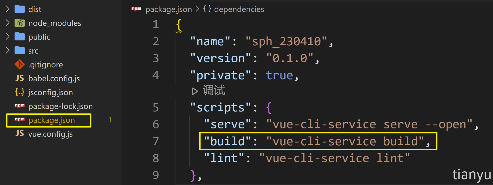

> 
## **1、项目打包**

- 我们开发用的脚手架其实就是一个微型服务器，用于：支撑开发环境、运行代理服务器等。
- 打包完的文件中不存在：`.vue`、`.jsx`、`.less` 等文件，而是：`html`、`css`、`js`等。
- 打包后的文件，不再借助脚手架运行，而是需要部署到服务器上运行。
- 打包前，请务必梳理好前端项目的`ajax`封装（请求前缀、代理规则等）。

## **2、本地服务器部署**

### **2.1. 具体操作步骤**

- **第一步：准备一个本地的服务器**

本地服务器可以用：`Java`、`Php`、`Go`、`Node.js` 等语言编写，本教程采用是`Node.js`编写服务器，端口号为：`8088`，且已经配置了`public`文件夹为静态资源。

点击下载服务器：

- **第二步：进行前端项目打包**

具体的打包命令，可以参考`package.json`中的`scripts`字段配置。



- **第三步：将打包结果交给服务器**

将打包生成的文件内容，放到服务器的静态资源文件夹中（上文中的`public`文件夹）

- **第四步：测试访问前端项目**

浏览器访问：`http://localhost:8088`即可看到我们的项目，但此时会遇到两个问题：

1. 页面刷新 404
2. ajax 请求无法发送

### **2.2. 解决刷新 404 问题**

问题分析：前端项目的路由，通常分为两种工作模式，分别为：

**1、`hash`模式**

hash 值又称锚点，通常用于指定网页中的某个位置，例如下面的网址：https://www.cctv.com/#SUBD1605080062959435，其中的#SUBD1605080062959435就是 hash 值，hash 值只在客户端（如浏览器）中使用，是不会带给服务器的，所以使用 hash 模式时，不存在刷新 404 问题。

**2、`history`模式**

history 去掉了`URL`中的`#`号，可以让应用的URL看起来更美观，带来的问题就是刷新时，会将前端路由携带给后端，而后端没有对应资源的匹配，就出现了 404 问题。

**解决方案一**：将前端路由器工作模式改为 hash 模式 —— 不太推荐。

**解决方案二**：让服务器在收到未配置的GET路由时，都返回`index.htm`l即可。

> 方案二最终其实是把 url 中的 path，交给了前端路由去处理，具体配置如下：
> 

```jsx
app.get('*',(req,res)=>{
 res.sendFile(__dirname + '/public/index.html')
})
```

也可以借助`connect-history-api-fallback`中间件完成配置

```jsx
const history = require('connect-history-api-fallback');
app.use(history());
// 配置静态资源
app.use(express.static(__dirname + '/public'))
```

使用`connect-history-api-fallback`可以让配置更灵活，比如/login临时不需要作为前端路由处理，就可以按照如下方式配置

```jsx
app.use(history({
	verbose:false,
	rewrites:[
		{ from: /^\/login.*$/, to: (context) => context.parsedUrl.path },
]
}))
```

### **2.3. 请求无法发送问题**

问题分析：脱离脚手架后，就没有了代理服务器，无法转发请求到【提供数据】的服务器。

如何解决？—— 在 Node 服务器中借助`http-proxy-middleware`中间件配置代理，具体配置如下：

```jsx
// 引入createProxyMiddleware
const { createProxyMiddleware } = require('http-proxy-middleware')

// 配置代理中间件
app.use('/dev', createProxyMiddleware({
	target: 'http://sph-h5-api.atguigu.cn',
	changeOrigin: true,
	pathRewrite: {
		'^/dev': ''
	}
}))
```

## **3. nginx 服务器部署**

### **3.1. nginx 简介**

Nginx（发音为“engine-x”）是一款高性能的 HTTP 服务器和反向代理服务器，同时也是一个 IMAP/POP3/SMTP 代理服务器。Nginx 最初由 Igor Sysoev 编写，于 2004 年发布。它以其高性能、高稳定性、丰富的功能集和低系统资源消耗而闻名，主要功能有：

1. **反向代理**
2. **负载均衡**
3. **静态内容服务**
4. **HTTP/2 支持**
5. **SSL/TLS 支持**
6. **高速缓存**

### **3.2. nginx 配置代理练习**

今日头条接口地址：`https://www.toutiao.com/hot-event/hot-board/?origin=toutiao_pc`

直接向其发送 Ajax 请求会有跨域问题，接下来我们借助`nginx`解决跨域问题

- **配置方式一：不过滤前缀**
  
    以解决今日头条跨域为例，不干`/hot-event`掉前缀配置如下:
    
    ```jsx
    location /hot-event {
      # 设置代理目标
      proxy_pass https://www.toutiao.com;
    
      # 允许跨域
      add_header 'Access-Control-Allow-Origin' '*';
      add_header 'Access-Control-Allow-Methods' '*';
      add_header 'Access-Control-Allow-Headers' '*';
      add_header 'Access-Control-Expose-Headers' '*';
    }
    ```
    
    前端写法
    
    ```jsx
    axios.get('http://localhost:8099/hot-event/hot-board/?origin=toutiao_pc')
    ```
    
- **配置方式二：过滤前缀**
  
    备注：使用下面配置删除上游服务器的指定响应头
    
    ```jsx
    proxy_hide_header Access-Control-Allow-Origin;
    ```
    

### **3.3. nginx 部署前端项目**

整体思路：让`nginx`充当**两个角色**，既是 **静态内容服务器**，又是**代理服务器**。

1. 修改`nginx`配置如下，注意`nginx`的根目录最好**不是 C 盘**

```jsx
# 配置nginx根目录
location / {
  root   D:\dist;
  index  index.html index.htm;
}

# 配置代理
location /dev/ {
  # 设置代理目标
  proxy_pass http://sph-h5-api.atguigu.cn/;
}
```

2. 修改前端项目，让所有请求都转发给 `/dev`，随后重新打包

```jsx
const request = axios.create({
  baseURL:'/dev',
  timeout:10000
})
```

3. 随后直接访问`nginx`服务器即可，例如 `nginx`如果运行在`8099`端口，则访问：

```powershell
http://localhost:8099
```

4. 随后会遇到刷新`404`问题，追加`nginx`配置来解决

```jsx
# 配置nginx根目录
location / {
  root   D:\dist;
  index  index.html index.htm;
  try_files $uri $uri/ /index.html; # 解决刷新404
}
# 配置代理
location /dev/ {
  # 设置代理目标
  proxy_pass http://sph-h5-api.atguigu.cn/;
}
```

## **4. 云服务器部署**

我们可以在云服务器上借助`nginx`完成部署，大致流程与本地`nginx`部署一致

1. 关于购买云服务器，可选择：阿里云、腾讯云等。
2. 关于操作系统，看个人习惯，Ubuntu、CentOs、RedHat、都不错。
3. 购买完成后记得重置密码
4. linux 远程操作软件：Xshell、Xftp
5. 具体配置如下：
- 给服务器安装`nginx`

```jsx
yum install nginx
```

- 将打包后的前端资源放在：`/var/sph`文件夹中。
- 使用`Xftp`配置服务器的 nginx，修改文件：`/etc/nginx/nginx.config`。

```jsx
# For more information on configuration, see:
#   * Official English Documentation: http://nginx.org/en/docs/
#   * Official Russian Documentation: http://nginx.org/ru/docs/

user nginx;
worker_processes auto;
error_log /var/log/nginx/error.log;
pid /run/nginx.pid;

# Load dynamic modules. See /usr/share/doc/nginx/README.dynamic.
include /usr/share/nginx/modules/*.conf;

events {
    worker_connections 1024;
}

http {
    log_format  main  '$remote_addr - $remote_user [$time_local] "$request" '
                      '$status $body_bytes_sent "$http_referer" '
                      '"$http_user_agent" "$http_x_forwarded_for"';

    access_log  /var/log/nginx/access.log  main;

    sendfile            on;
    tcp_nopush          on;
    tcp_nodelay         on;
    keepalive_timeout   65;
    types_hash_max_size 2048;

    include             /etc/nginx/mime.types;
    default_type        application/octet-stream;

    # Load modular configuration files from the /etc/nginx/conf.d directory.
    # See http://nginx.org/en/docs/ngx_core_module.html#include
    # for more information.
    include /etc/nginx/conf.d/*.conf;

    server {
        listen       80 default_server;
        listen       [::]:80 default_server;
        server_name  _;
        root         /usr/share/nginx/html;

        # Load configuration files for the default server block.
        include /etc/nginx/default.d/*.conf;

        location / {
          root   /var/sph;
          index  index.html index.htm;
          try_files $uri $uri/ /index.html; # 解决刷新404
        }
        # 配置代理
        location /dev/ {
          # 设置代理目标
          proxy_pass http://sph-h5-api.atguigu.cn/;
        }

        error_page 404 /404.html;
            location = /40x.html {
        }

        error_page 500 502 503 504 /50x.html;
            location = /50x.html {
        }
    }
}
```